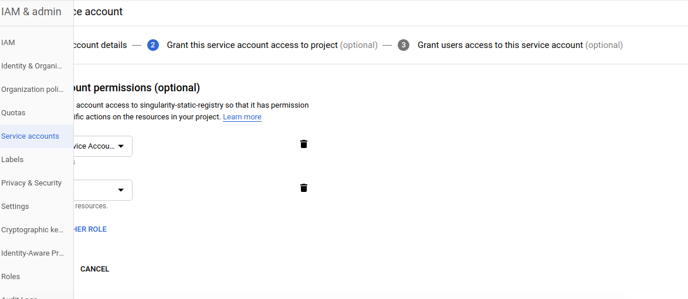
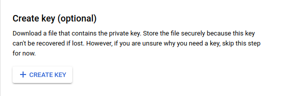

# BusyBox

This is a library of busybox builds for Singularity images hosted on Singularity Static Registry. The following standard applies:

 - each `Singularity` file corresponds to a build
 - tags are supported based on the extension of the Singularity file, with an extensionless file corresponding to "latest"

## What can I find here?

The repository here serves the container under the namespace `singularityhub/busybox`. Specifically,
it provides an example of using the [Google Container Builder]().

## How does this work?

We will submit this container to the (organizational) registry at 
[singularityhub/registry-org](https://www.github.com/singularityhub/registry-org)
for a final container uri corresponding to `https://singularityhub.github.io/registry-org/singularityhub/busybox`. Specifically:

```
singularityhub/registry-org  --) the organization registry
singularityhub/busybox        --) a container collection
```

then on GitHub pages:

```
singularityhub.github.io/registry-org                       --) the registry interface
singularityhub.github.io/registry-org/singularityhub/busybox --) the added container
```

## Google Storage

We will be interacting with Google Storage via the [sregistry](https://www.github.com/singularityhub/sregistry)
command line client.

## Required environment variables

We are going to be following the [instructions here](https://circleci.com/docs/2.0/google-auth/)
to authorize the Google Cloud SDK. Specifically, you should have 
created a Google Project and [created a service account](https://cloud.google.com/sdk/docs/authorizing#authorizing_with_a_service_account).

### 1. Download the Service Account Key

You should first download a service account key from the [service accounts page](https://console.cloud.google.com/iam-admin/serviceaccounts?_ga=2.213389911.-231410963.1512057989). For the roles, add an admin for Google
Storage (to store your container). If you want to use the Google Cloud Builder (a similar
configuration, example at [nginx](https://www.github.com/singularityhub/nginx)) then you can also add Google Build. 



Once you add the roles, you *do not need to add users* to the account. You can next download
the service account key to your local machine, and move it to the repository folder.



Note that the .gitignore includes *.json so it won't be added to your project!

### 2. Circle CI Secrets

Once you have the `<project-id>-<number>.json` in the present working directory,
you can add the entire thing to your project as an encrypted environment variable.
Here is how to copy paste the string from your terminal:

```bash
$ cat <project-id>-<number>.json
```

Add the text output from the above to an environment variable
called `GOOGLE_APPLICATION_CREDENTIALS` along with the following (all project secrets):

 - GOOGLE_COMPUTE_ZONE: the zone you want your compute builder to run in.
 - SREGISTRY_GOOGLE_PROJECT: the id of your project, easiest to find in the Google Project console url.

Optionally, export a name for your bucket, `SREGISTRY_GOOGLE_STORAGE_BUCKET` 
(it will be created if it doesn't exist).  It will default to your project id with sregistry- as a prefix.
